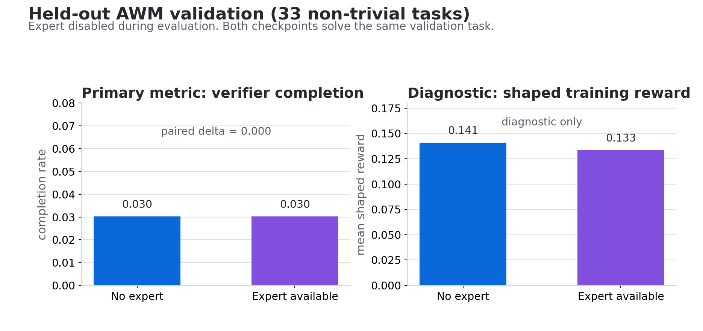
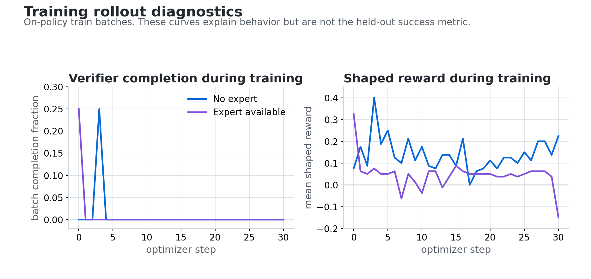

# AWM expert-in-the-loop

This example ports the dynamic expert-in-the-loop idea from
[huggingface/OpenEnv#428](https://github.com/huggingface/OpenEnv/pull/428) onto
the current, hardened `agent_world_model_env`.

The expert is a client-side virtual tool named `ask_expert`. It is never
registered with the AWM server and never appears in `list_tools()`. The agent can
choose to call it during rollout; the client intercepts that call, asks a frontier
model for verifier-informed guidance, then adds the expert's response back to the
conversation as an observation.

## What is included

- `rollout.py`: one AWM task episode from `reset` to final `verify`.
- `expert.py`: a verifier-informed frontier advisor that reads verifier code from
  the public `Snowflake/AgentWorldModel-1K` dataset, not from server internals.
- `run_benchmark.py`: baseline vs expert evaluation.
- `build_split.py` and `splits/workflow_automation.json`: an honest, pinned split
  that excludes verifier-less tasks and no-op tasks that pass without actions.
- `assets/`: public-safe research plots and `results_summary.json` from a completed
  Foundry Fine-Tuning run and held-out eval.
- `example_usage.py` and `run_awm_task.py`: small runnable examples.
- `test_rollout.py`: pure unit tests that do not require network or model access.

## Setup

From the repository root:

```bash
PYTHONPATH=src:envs uv run uvicorn \
    envs.agent_world_model_env.server.app:app --host 127.0.0.1 --port 8899
```

In another terminal, configure an OpenAI-compatible model endpoint:

```bash
export AZURE_OPENAI_ENDPOINT="https://<resource>.openai.azure.com/"
export AZURE_OPENAI_API_KEY="<key>"
export AZURE_OPENAI_REASONING_NAME="gpt-5.5"
```

If `AZURE_OPENAI_API_KEY` is omitted, `run_benchmark.py` uses Entra ID through
`DefaultAzureCredential`; install the optional `azure-identity` dependency first.

## Run the pinned validation split

Use the committed split for honest evaluation:

```bash
PYTHONPATH=src:envs uv run python examples/awm_expert_in_the_loop/run_benchmark.py \
    --split examples/awm_expert_in_the_loop/splits/workflow_automation.json \
    --split-section val \
    --condition both \
    --agent-model "$AZURE_OPENAI_REASONING_NAME" \
    --expert-model "$AZURE_OPENAI_REASONING_NAME"
```

The split contains 63 train tasks and 33 validation tasks. Every task has a code
verifier, and a no-op `reset -> verify` does not pass.

## Run a quick scenario-level smoke test

When no split is provided, the benchmark filters trivial tasks by default:

```bash
PYTHONPATH=src:envs uv run python examples/awm_expert_in_the_loop/run_benchmark.py \
    workflow_automation_1 \
    --tasks 1 \
    --condition expert \
    --max-iters 4
```

Use `--no-filter-trivial` only for debugging.

## Foundry Fine-Tuning result

We ran this recipe on the committed `workflow_automation` split with Qwen/Qwen3.5-4B
using a Tinker-style `forward_backward` + `optim_step` backend. The run completed
successfully for both conditions:

| Condition | Train steps | Mean shaped train reward | Max train batch completion | Held-out complete rate |
|---|---:|---:|---:|---:|
| No expert | 31 | 0.140 | 0.25 | 1/33 |
| Expert available | 31 | 0.046 | 0.25 | 1/33 |

The correct interpretation is conservative: the backend training and held-out eval
succeeded, but this configuration does **not** demonstrate an expert improvement.
Both final checkpoints completed the same held-out task and tied on verifier reward.
The no-expert condition scored slightly higher on shaped training reward because it
took more tool turns, and this shaping is not the primary task-success metric.





For the machine-readable summary, see `assets/results_summary.json`.

## Attribution

This example builds on the expert-in-the-loop track from PR #428. Original work
is credited to Mert Hidayetoglu (`@sfc-gh-mhidayetoglu`) and Karthik Ganesan
(`@sfc-gh-kganesan`) through commit co-author trailers and PR attribution.
