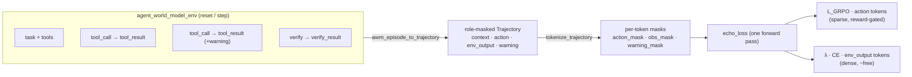

# ECHO on the Agent World Model environment

> **The world is a free loss function.** Standard agent-RL masks out the
> environment's responses and trains only on the agent's own tokens. **ECHO** keeps
> that thrown-away signal: alongside the usual policy-gradient on *action* tokens, it
> adds a tiny cross-entropy loss that makes the policy **predict the environment's
> observation tokens** — which it already computed in the same forward pass.
>
> ```
> L_ECHO = L_GRPO(action tokens) + λ · CE(observation tokens)
> ```

This example runs that idea on a **real, upstream** environment:
[`envs/agent_world_model_env`](../../envs/agent_world_model_env) — *AgentWorldModel-1K*,
a suite of **1,000 MCP tool-use environments / 10,000 tasks**. AWM episodes are long
and tool-heavy, so most of their tokens are environment observations — exactly the
signal ECHO recovers.

It is a companion to **RFC 010 / PR #16** (the ECHO proposal + a toy terminal env)
and the proposal issue **#14**. Where #16 introduces the primitive, this shows it on
a real env you can `reset()` and `step()` today.

## Why AWM is a perfect fit for ECHO

ECHO needs one thing OpenEnv doesn't yet carry: a **per-token role mask** that says,
for each token, whether it was the agent's *action* or the environment's
*observation* (and, finer, real env output vs. harness boilerplate). An
`AWMObservation` already separates these — the adapter is almost a 1:1 mapping:

| `AWMObservation` field        | ECHO role     | used for                                   |
| ----------------------------- | ------------- | ------------------------------------------ |
| `task` / `scenario`           | `CONTEXT`     | given — never a loss target                |
| *(the agent's tool call)*     | `ACTION`      | GRPO / policy-gradient target              |
| `tool_result` / `error`       | `ENV_OUTPUT`  | **the ECHO world-model target** (free)     |
| `verify_result`               | `ENV_OUTPUT`  | real grader output                         |
| `warning`                     | `WARNING`     | harness boilerplate — excluded by default  |

That last row matters: AWM *already* distinguishes real environment output from
harness `warning` text — precisely the `completion_warning_masks` distinction ECHO's
reference code carries, so warnings don't leak into (and get memorized by) the world
loss.



## What's here

| File | Role |
| ---- | ---- |
| `echo.py` | Self-contained ECHO core — roles, `tokenize_trajectory`, `echo_loss` (distilled from RFC 010 / PR #16). |
| `awm.py` | **The new bit** — `awm_episode_to_trajectory` (AWM episode → role-masked `Trajectory`) and `live_capture` (replay tool calls against a running AWM server, capturing real observations). |
| `run_demo.py` | End-to-end walkthrough: role accounting + the loss three ways. Offline by default; `--hf` for a real model; `--live` for a real server. |
| `fixtures/awm_ecommerce_episode.json` | A representative AWM e-commerce episode (search → inspect → add-to-cart → verify). |
| `test_echo_on_awm.py` | Pins the role-mask partition, the "free signal" property, and the loss invariants. |

## Run it

```bash
cd examples/echo_on_agent_world_model
python -m venv .venv && source .venv/bin/activate
pip install -r requirements.txt

python run_demo.py                       # offline, deterministic, no downloads
python run_demo.py --hf sshleifer/tiny-gpt2   # real HF tokenizer + model (optional)
python run_demo.py --live http://localhost:8899   # capture from a running AWM server
pytest -q                                # 8 tests
```

Offline output (deterministic):

```
================================================================
AWM scenario : e_commerce_33  (task_idx 0)
steps        : 4   reward: 1.0
----------------------------------------------------------------
per-token roles (target tokens):
  context       415   (given — never a loss target)
  action        372   (GRPO / policy-gradient target)
  env_output    911   (ECHO world-model target — normally discarded)
  warning        76   (harness boilerplate — excluded from env loss)
----------------------------------------------------------------
ECHO 'free signal' (this episode): 911/1283 learnable tokens (71%) are env observations
                    standard agent-RL trains on 372 action tokens; ECHO adds 911 more (2.4x), with no extra
                    env interaction or rollout inference (logits already computed)
----------------------------------------------------------------
loss on the SAME forward pass (action term is REINFORCE-style; advantage =
reward is a 1-sequence stand-in for GRPO's group-relative advantage):
  GRPO-style (λ=0)           loss=+4.4277  (action term only; l_env=4.4096 computed but unused)
  ECHO (λ=0.05)             loss=+4.6482  (l_grpo=+4.4277 + 0.05·l_env, l_env=4.4096)
  verifier-free (reward off) loss=+4.4096  (pure env-token CE — l_grpo=0)
================================================================
```

**The result in one line:** in this example episode, **~71% of the learnable tokens
are environment observations** — ~**2.4×** the agent's action tokens — which standard
agent-RL masks out and ECHO turns into dense training signal, with **no extra
environment interaction or rollout inference** (the observation logits are already
computed; the only added cost is a small extra loss/backward term). The ratio holds
with a real sub-word tokenizer too (`--hf`: ~72%). These are *token-accounting*
numbers on one fixture — not a trained-model benchmark.

### Live mode (real environment output)

```bash
# terminal 1 — start the upstream AWM server (from the repo root)
PYTHONPATH=src:envs uv run uvicorn \
    envs.agent_world_model_env.server.app:app --host 0.0.0.0 --port 8899

# terminal 2 — replay the fixture's tool calls against the real env and build the
# ECHO trajectory from the *actual* observations it returns (run from this dir;
# src + envs must be importable so `agent_world_model_env` resolves)
PYTHONPATH=../../src:../../envs python run_demo.py --live http://localhost:8899
```

`--live` takes the real task/scenario/tool list from `reset()`/`list_tools()`,
captures genuine `tool_result`/`verify_result` observations, and releases the session
with `done`. The fixture's scripted tool calls stand in for what a policy would
choose (no trained policy required).

## How this connects

- **RFC 010 / PR #16** (proposal #14) — the ECHO objective + role-mask schema. This
  example is the "real environment" companion to #16's toy terminal env.
- **#12** (model-optimization backends: Tinker + Ray async-RL) — where the masks
  produced here are consumed: over the *same rollout* (no new sampling), ECHO is two
  accumulated `forward_backward` passes (importance-sampling on actions + λ-scaled
  cross-entropy on observations) before one `optim_step`.
- **AWM** ([upstream env](../../envs/agent_world_model_env); hackathon track in
  upstream PR #428) — the substrate; 1k envs of exactly the long, observation-heavy
  trajectories where ECHO pays off.
- **ACA cloud sandbox** (PR #4 / upstream #793) — the runtime the rollouts can execute in.

## Status

Reference / demonstration. The `echo.py` core is intentionally a self-contained copy
of the RFC 010 primitive so this example runs standalone against `main`; if/when the
primitive lands upstream, this example would import it instead. Numbers above are
illustrative of *token accounting*, not a trained-model benchmark — see the ECHO
paper (arXiv:2605.24517) and `microsoft/echo-rl` for trained results
(~2.3× faster RL; TerminalBench-2.0 pass@1 ~doubles).
