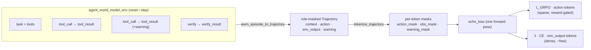

# ECHO on the Agent World Model environment

> **The world is a free loss function.** Standard agent-RL masks out the
> environment's responses and trains only on the agent's own tokens. **ECHO** keeps
> that thrown-away signal: alongside the usual policy-gradient on *action* tokens, it
> adds a tiny cross-entropy loss that makes the policy **predict the environment's
> observation tokens**, which it already computed when reading them.
>
> ```
> L_ECHO = L_GRPO(action tokens) + λ · CE(observation tokens)
> ```

This example runs that idea on a **real, upstream** environment:
[`envs/agent_world_model_env`](../../envs/agent_world_model_env) — *AgentWorldModel-1K*,
a suite of **1,000 MCP tool-use environments / 10,000 tasks**. The bundled fixture is a
**real captured `e_commerce_33` episode** (see `capture_episode.py`), and `--live`
re-runs it against a live AWM server. AWM episodes are long and tool-heavy, so the vast
majority of their tokens are environment observations — exactly the signal ECHO recovers.

It pairs with the [`echo_world_model`](../echo_world_model/) terminal reference and
**RFC 010** in this PR. Two examples, two questions: the terminal
reference shows ECHO **learns** (it trains a small model on CPU in about 40s), and this one
shows ECHO is **real** (the role masks fall out of a real env you can `reset()` and `step()`
today). Both run on a laptop with no cloud account.

## Why AWM is a perfect fit for ECHO

ECHO needs one thing OpenEnv doesn't yet carry: a **per-token role mask** that says,
for each token, whether it was the agent's *action* or the environment's
*observation* (and, finer, real env output vs. harness boilerplate). An
`AWMObservation` already separates these — the adapter is almost a 1:1 mapping:

| `AWMObservation` field        | ECHO role     | used for                                   |
| ----------------------------- | ------------- | ------------------------------------------ |
| `task` / `scenario`           | `CONTEXT`     | given — never a loss target                |
| *(the agent's tool call)*     | `ACTION`      | GRPO / policy-gradient target              |
| `tool_result` / `error`       | `ENV_OUTPUT`  | **the ECHO world-model target** (free)     |
| `verify_result`               | `ENV_OUTPUT`  | real grader output                         |
| `warning`                     | `WARNING`     | harness boilerplate — excluded by default  |

That last row matters: AWM *already* distinguishes real environment output from
harness `warning` text — precisely the `completion_warning_masks` distinction ECHO's
reference code carries, so warnings don't leak into (and get memorized by) the world
loss.



## What's here

| File | Role |
| ---- | ---- |
| `echo.py` | Self-contained ECHO core — roles, `tokenize_trajectory`, `echo_loss` (distilled from RFC 010). |
| `awm.py` | **The new bit** — `awm_episode_to_trajectory` (AWM episode → role-masked `Trajectory`) and `live_capture` (replay tool calls against a running AWM server, capturing real observations). |
| `run_demo.py` | End-to-end walkthrough: role accounting + the loss three ways. Offline by default; `--hf` for a real model; `--live` for a real server. |
| `capture_episode.py` | How the fixture was made — runs a correct solution to the real `e_commerce_33` task against a live server and records every real `(action, observation)`. |
| `fixtures/awm_ecommerce_episode.json` | A **real captured** `e_commerce_33` episode (search → offers → cart → add → list → verify). |
| `test_echo_on_awm.py` | Pins the role-mask partition, the "free signal" property, warning separation, and the loss invariants (10 tests). |

## Run it

```bash
cd examples/echo_on_agent_world_model
python -m venv .venv && source .venv/bin/activate
pip install -r requirements.txt

python run_demo.py                       # offline, deterministic, no downloads
python run_demo.py --hf sshleifer/tiny-gpt2   # real HF tokenizer + model (optional)
pytest -q                                # 10 tests
```

(`--live` and re-capturing the fixture need a running AWM server — see **Live mode** below.)

Offline output (deterministic, on the real captured episode):

```
================================================================
AWM scenario : e_commerce_33  (task_idx 0)
task         : Search for 'wireless noise cancelling headphones', sort results by ave...
steps        : 6   reward: 0.0
----------------------------------------------------------------
per-token roles (target tokens):
  context      1304   (given — never a loss target)
  action        588   (GRPO / policy-gradient target)
  env_output   4659   (ECHO world-model target — normally discarded)
  warning         0   (harness boilerplate — excluded from env loss)
----------------------------------------------------------------
ECHO 'free signal' (this episode): 4659/5247 learnable tokens (89%) are env observations
                    standard agent-RL trains on 588 action tokens; ECHO adds 4659 more (7.9x), with no extra
                    env interaction or rollout inference (logits already computed)
----------------------------------------------------------------
loss on the SAME forward pass (action term is REINFORCE-style; advantage =
reward=+0.0, a 1-sequence stand-in for GRPO's group-relative advantage):
  GRPO-style  (action only)  loss=+0.0000
  ECHO        (action + λ·env)loss=+0.2212  (λ=0.05, l_env=4.4239)
  verifier-free (env CE only)loss=+4.4239  (reward off → pure env-token CE)

  ↳ this real episode's verifier returned no success signal (reward 0), so the
    policy-gradient term is exactly 0 — standard agent-RL learns nothing here.
    ECHO still extracts dense signal from 4659 observation tokens. Sparse or
    ambiguous reward is exactly ECHO's motivating case (see verifier-free above).
================================================================
```

**The result in one line:** on this real `e_commerce_33` episode, **89% of the learnable
tokens are environment observations** — ~**7.9×** the agent's action tokens — which
standard agent-RL masks out and ECHO turns into dense training signal, with **no extra
environment interaction or rollout inference** (the observation logits are already
computed; the only added cost is a small extra loss/backward term). And because the
deterministic verifier returns **no success signal here (reward 0)**, the policy-gradient
term is exactly zero — yet ECHO still learns from the observations. *Sparse / ambiguous
reward in realistic agentic tasks is precisely ECHO's motivating case.* (Numbers are
*token accounting* on one real episode — not a trained-model benchmark.)

### Live mode (real environment output)

The AWM server spins up a per-scenario sub-env; install its deps once, then run it:

```bash
# from the repo root — install env deps + torch (for the ECHO loss in run_demo)
uv sync --all-extras
uv pip install torch sqlalchemy fastapi-mcp

# terminal 1 — start the upstream AWM server
PYTHONPATH=src:envs uv run uvicorn \
    envs.agent_world_model_env.server.app:app --host 0.0.0.0 --port 8899

# terminal 2 — re-run the episode against the real env, building the ECHO trajectory
# from the *actual* observations it returns
PYTHONPATH=src:envs uv run python \
    examples/echo_on_agent_world_model/run_demo.py --live http://localhost:8899

# (optional) re-record the fixture from a fresh real rollout
PYTHONPATH=src:envs uv run python \
    examples/echo_on_agent_world_model/capture_episode.py --base-url http://localhost:8899
```

`--live` takes the real task/scenario/tool list from `reset()`/`list_tools()`, captures
genuine `tool_result`/`verify_result` observations, and releases the session with `done`.
The scripted tool calls stand in for what a policy would choose (no trained policy
required). You can also point `--live` at the hosted Space
(`--live https://chilled-agent-world-model-env.hf.space`).

## How this connects

- **RFC 010**: the ECHO objective + role-mask schema. This
  example is the real-environment companion to the [`echo_world_model`](../echo_world_model/) terminal reference.
- **Model-optimization backends** (Tinker + Ray async-RL): where the masks
  produced here are consumed. Over the *same rollout* (no new sampling, no teacher),
  ECHO adds a λ-scaled cross-entropy on the observation tokens. A trainer can fold this
  into one `forward_backward` with per-token advantages (RFC 010 implementation note),
  or run it as a second accumulated `forward_backward` before one `optim_step`.
- **AWM** (the Agent World Model env, added in huggingface/OpenEnv#428): the
  substrate; 1k envs of exactly the long, observation-heavy
  trajectories where ECHO pays off.
- **ACA cloud sandbox** (huggingface/OpenEnv#793): the runtime the rollouts can execute in.

## Status

Reference / demonstration. The `echo.py` core is intentionally a self-contained copy
of the RFC 010 primitive so this example runs standalone against `main`; if/when the
primitive lands upstream, this example would import it instead. Numbers above are
illustrative of *token accounting*, not a trained-model benchmark — see the ECHO
paper (arXiv:2605.24517) and `microsoft/echo-rl` for trained results
(~2.3× faster RL; TerminalBench-2.0 pass@1 ~doubles).

## Credits and citation

This example runs on the **Agent World Model** environment (`envs/agent_world_model_env`),
part of upstream OpenEnv, created by Snowflake AI Research and UNC-Chapel Hill. The bundled
`fixtures/awm_ecommerce_episode.json` is a captured rollout from that environment's
`e_commerce_33` scenario. This example adds only the ECHO adapter on top.

- Paper: Agent World Model, Infinity Synthetic Environments for Agentic Reinforcement Learning (arXiv:2602.10090)
- Dataset: [Snowflake/AgentWorldModel-1K](https://huggingface.co/datasets/Snowflake/AgentWorldModel-1K) (CC-BY-4.0)
- Pipeline: [Snowflake-Labs/agent-world-model](https://github.com/Snowflake-Labs/agent-world-model)

```bibtex
@article{wang2026agentworldmodelinfinity,
  title={Agent World Model: Infinity Synthetic Environments for Agentic Reinforcement Learning},
  author={Zhaoyang Wang and Canwen Xu and Boyi Liu and Yite Wang and Siwei Han and Zhewei Yao and Huaxiu Yao and Yuxiong He},
  year={2026},
  eprint={2602.10090},
  archivePrefix={arXiv},
  primaryClass={cs.AI},
  url={https://arxiv.org/abs/2602.10090}
}
```

The ECHO objective is from `microsoft/echo-rl` (arXiv:2605.24517).

The bundled fixture data is licensed CC-BY-4.0 via Snowflake/AgentWorldModel-1K; the
example code in this directory remains under the repository license.
