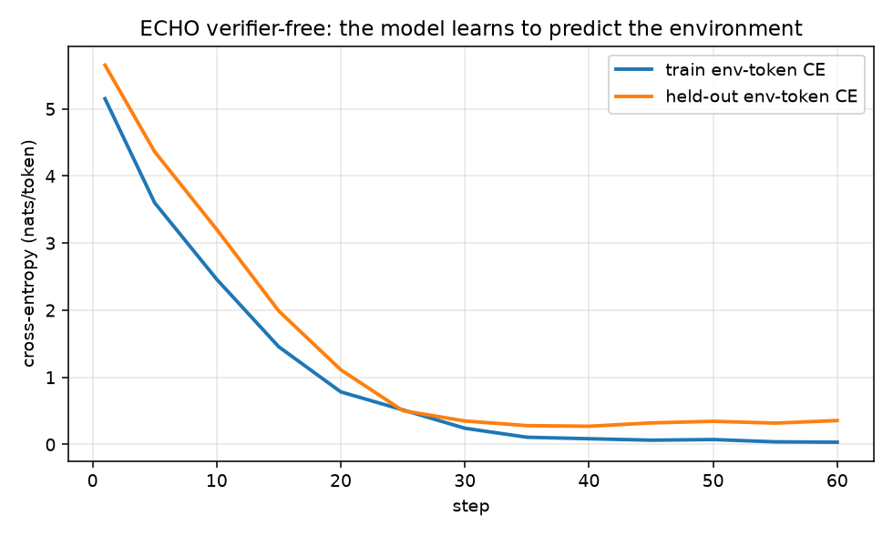

# ECHO: the world is a free loss function

> The runnable reference for **RFC 010**
> ([`rfcs/010-echo-env-token-world-model.md`](../../rfcs/010-echo-env-token-world-model.md)).
> This example **trains** a small model on a toy terminal env (the proof
> ECHO learns); its sibling [`echo_on_agent_world_model`](../echo_on_agent_world_model/) shows the
> same role masks on a real upstream env.

**Scenario: forward-deployed incident triage.** An alert fires; a small agent
opens a terminal in the customer's box (an **ACA Sandbox**) and investigates the
logs/config to find the root cause. It only gets good if it learns how *that*
environment responds to its commands — a **world model** — which is what ECHO
builds, almost for free.

During agent RL we normally **mask out** the environment's response tokens and
only train on the agent's actions. **ECHO** ([arXiv 2605.24517](https://arxiv.org/abs/2605.24517),
[`microsoft/echo-rl`](https://github.com/microsoft/echo-rl); and Prime Intellect's
[*"True Agents Model the World"*](https://www.primeintellect.ai/blog/true-agents-model-the-world)) adds
a tiny cross-entropy loss that makes the policy **predict the environment's
observation tokens** too:

```
L_ECHO = L_GRPO(action tokens)  +  λ · L_env(observation tokens)
```

The model already conditions on those observation tokens and already computes
their logits in the same forward pass — so the extra world-modeling signal is
**~free**: no extra rollouts, no teacher, no separate world model, just a
different mask over logits you already have. Reported: **~2.3× faster** RL,
[TerminalBench-2.0](https://www.tbench.ai/) pass@1 ~**doubles**, recovers **50–104%** of expert-SFT with
no teacher, and even **verifier-free** (reward off) improves held-out tasks.

## Why OpenEnv needs a small change

ECHO is "a few lines on top of any GRPO trainer," **but** the trainer has to know,
*per token*, which tokens were the agent's **actions** vs the environment's
**observations** (and, finer, real `env_output` vs harness `warning`). OpenEnv's
`EpisodeRecord` is **message-level** — it has no per-token role masks. This
example makes the missing piece concrete in [`trajectory.py`](./trajectory.py),
and the RFC proposes carrying it in the trajectory schema (RFC 009) + exposing
`λ`/`world_loss_target`/filters on the optimizer seam (RFC 007).

## What this demo shows (runs on CPU, ~40s)

The **verifier-free** core: a small model, no grader, no teacher — it just acts
in a tiny deterministic terminal env and learns to **predict what the terminal
returns**, measured on **held-out** tasks (new commands over the same files), so
it's generalization, not memorization.

```bash
python -m venv .venv && source .venv/bin/activate
pip install -r requirements.txt
python train_echo.py --steps 60 --seed 0    # distilgpt2, CPU, ~40s
```

Example output (distilgpt2, 60 steps, CPU, `--seed 0` — reproducible):

```
held-out env-token CE:  6.182  ->  0.271 nats/token (+96%, best @ step 40)

teacher-forced prediction of `grep WARN app.log` output on a HELD-OUT task:
  actual    : 'WARN  retry budget low for shipping-svc\nWARN  disk usage at 81 percent'
  before    : '________________________________ [--------------r\n.- the\noutg.$  ret-: the.'   (token acc 5%)
  after ECHO: 'ERROR payment retry budget low for shipping-svc\nERROR  disk usage at 81 percent'   (token acc 84%)
```

→ it nails the held-out log lines it was never trained to grep (the *content* it
learned from `cat`), missing only the level prefix — at **84% token accuracy**,
**verifier-free**, on a tiny model, in ~40s on a laptop CPU. `echo_run.png` shows
train + held-out env-token CE dropping together, then the mild overfitting Prime
Intellect also reports — which is why `λ` is small, the env loss is `env_only`,
and the rollout filters exist.



## Files

| File | What |
|---|---|
| [`mini_terminal_env.py`](./mini_terminal_env.py) | Deterministic terminal env (fixed mini-FS; `ls`/`cat`/`grep`/`wc`/`head`). OpenEnv-shaped `reset`/`step`. |
| [`trajectory.py`](./trajectory.py) | The missing piece: a rollout with **per-token role masks** (`action` / `env_output` / `warning`). |
| [`echo_loss.py`](./echo_loss.py) | `L_GRPO(actions) + λ·L_env(obs)`. `λ=0` ⇒ vanilla GRPO; `use_rl=False` ⇒ verifier-free. |
| [`rollout.py`](./rollout.py) | Oracle + policy rollouts → role-tagged trajectories. |
| [`train_echo.py`](./train_echo.py) | The CPU demo above. |
| [`test_echo.py`](./test_echo.py) | Unit tests for the loss + masks (`python -m pytest test_echo.py`). |
| [`backends/`](./backends/) | The same config for the real GPU run: [SkyRL](./backends/skyrl.md) (open reference), [Tinker](./backends/tinker.md), [Foundry Fine-Tuning](./backends/foundry-finetuning.md), with rollouts isolated in [ACA Sandboxes](./backends/aca-sandboxes.md). |

## The full hybrid (GRPO + ECHO) and the real numbers

This CPU demo isolates the **env-token loss** (the part that needs no GPU to be
convincing). The full `L_GRPO(actions) + λ·L_env(obs)` loop — and the
~2.3×/pass@1-doubling results — needs a GPU; `echo_loss.py` is the exact
objective, and [`backends/`](./backends/) shows the one-line config on SkyRL /
Tinker / Foundry Fine-Tuning. To show ECHO end-to-end you set up a small model and fine-tune it
with this loss; start with [SkyRL](./backends/skyrl.md).
