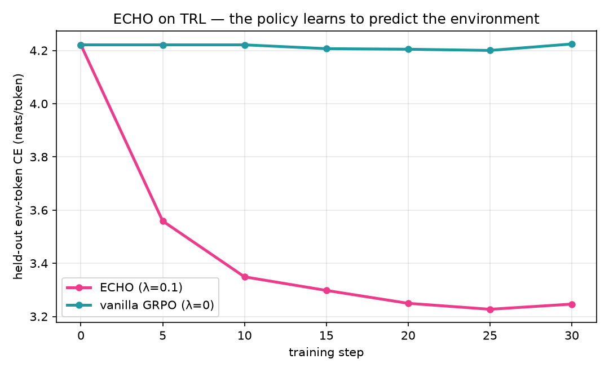

# ECHO on TRL

[TRL](https://huggingface.co/docs/trl) is the framework OpenEnv recommends for RL
training (see `docs/source/guides/rl-integration.md` and the Wordle-GRPO
tutorial), so it is the natural place to run ECHO from an OpenEnv rollout.

A runnable CPU proof-of-concept ships here:
[`trl_echo_demo.py`](./trl_echo_demo.py). It reproduces ECHO's **world-model
result** (Figure 3 of the paper: held-out env-token cross-entropy drops with ECHO
and stays flat with vanilla GRPO), not the performance numbers (those need the
full GPU run, see [SkyRL](./skyrl.md)).



## The masks map onto what TRL already has

| OpenEnv `trajectory.py` | TRL `GRPOTrainer` |
|---|---|
| `action_mask` | the completion / assistant-token mask (the GRPO target) |
| `obs_mask` (`env_only`) | the tool/env-response tokens TRL **masks out** of the loss |
| `warning_mask` | harness boilerplate, excluded from the env loss |

The key asymmetry: through `environment_factory`, TRL drives the multi-turn rollout
itself, so it **builds the `tool_mask`** (model tokens = 1, env/tool-response tokens
= 0) and already **masks the env tokens out** of the policy-gradient loss. That
mask-out is exactly the "discard the environment" behavior ECHO reverses, and the
env tokens are simply `completion_mask * (1 - tool_mask)`.

Because TRL builds that mask in the white-box (`environment_factory`) path, this demo
needs **no OpenEnv core change**. RFC 010 Part A (carrying the masks in the trajectory)
is for the black-box case, where an external harness owns the rollout and the trainer
cannot reconstruct the per-token roles itself.

## The one change: a `GRPOTrainer` subclass

Add a length-normalized cross-entropy on the env tokens, **reusing the per-token
logps GRPO already computed** (a second forward pass would forfeit ECHO's "~free"
property). GRPO's loss does not return them, so cache them from the grad-enabled
policy call:

```python
class EchoGRPOTrainer(GRPOTrainer):
    def __init__(self, *args, world_model_coeff=0.1, **kwargs):
        super().__init__(*args, **kwargs)
        self.world_model_coeff = world_model_coeff
        self._policy_logps = None

    def _get_per_token_logps_and_entropies(self, *args, **kwargs):
        out = super()._get_per_token_logps_and_entropies(*args, **kwargs)
        if out[0].requires_grad:  # the policy forward we backprop through
            self._policy_logps = out[0]
        return out

    def _compute_loss(self, model, inputs):
        loss = super()._compute_loss(model, inputs)
        obs_mask = inputs["completion_mask"] * (1 - inputs["tool_mask"])
        env_ce = -(self._policy_logps * obs_mask).sum() / obs_mask.sum().clamp(min=1.0)
        return loss + self.world_model_coeff * env_ce
```

`world_model_coeff = 0.0` is exactly vanilla GRPO. See
[`trl_echo_demo.py`](./trl_echo_demo.py) for the full runnable version.

## Notes (shared with the other backends)

- Keep the GRPO importance-ratio / clipping / KL on the action tokens only, not on
  the env cross-entropy term.
- Keep λ small. Prime Intellect saw collapse at `0.05` for GLM-4.5-Air (stable at
  `0.005`); echo-rl's published Qwen3-8B config uses `0.05`. Expose it and sweep.
- Train on the real env output, not harness boilerplate (the `env_only` vs
  `warning` distinction); pure-retrieval outputs can fail to generalize.

> For an open, reproducible run that already implements ECHO at scale, use
> [SkyRL](./skyrl.md). This note is the path for the TRL-native stack.
